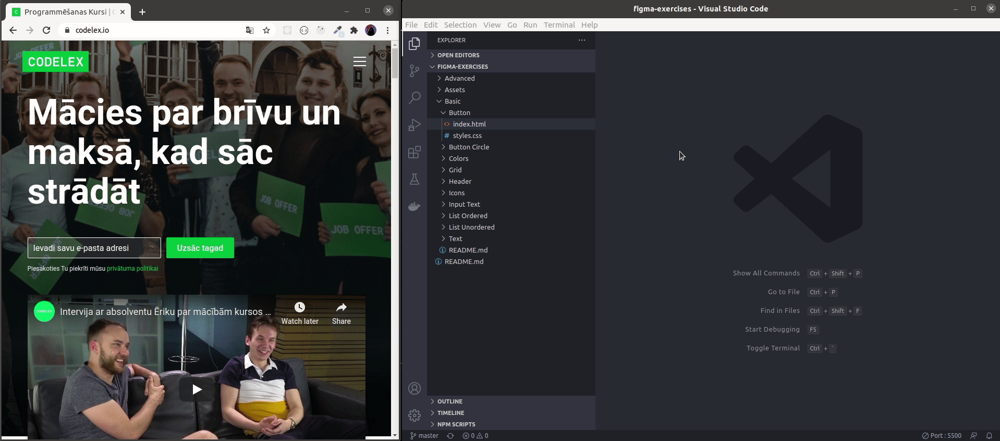
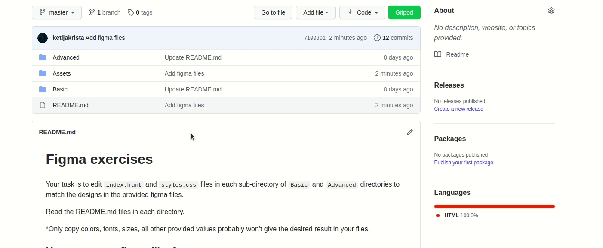
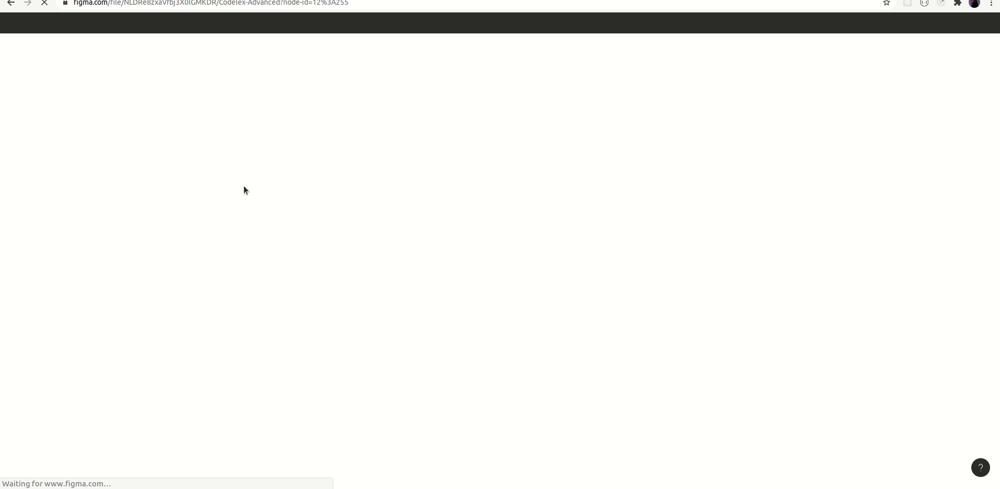

# Figma exercises
Your task is to edit `index.html` and `styles.css` files in each sub-directory of `Basic` and `Advanced` directories to match the designs in the provided figma files.

Each sub-directory is a seperate excercise.

Read the README.md files in each directory.

*Only copy colors, fonts and sizes from figma, all other provided values probably won't give the desired result in your files.

## How to see your changes to files?

1. On the left side of your code editor find `Extentions` marketplace.
2. Search for `Live Server` plugin and add it to your code editor.
3. Right click on one of your `index.html` files and select `Open with Live Server`, this will open a window in your default browser where you can can see all changes made to the `index.html` as you go.

*Don't forget to save your changes or turn on autosave

## How to do the excercises? 

Right click on this gif and download it to better see what's going on.

## How to access figma files?

1. Create a profile in [figma.com](figma.com).
2. Download the provided `.fig` files from `Assets` directory.

3. Add the downloaded `.fig` files to your `Drafts` in the figma homepage. 

    [Importing files into Figma](https://help.figma.com/hc/en-us/articles/360041003114-Import-files-into-Figma)

4. Open the files from `Drafts`.

## How to get styles from figma

